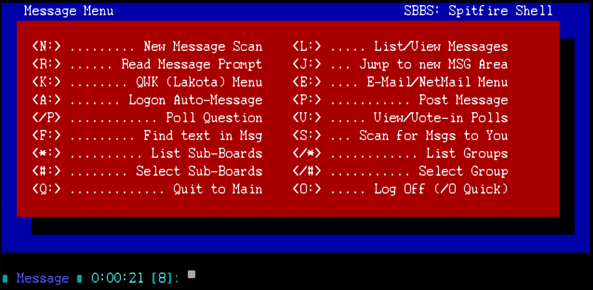

# Spitfire Command Shell for Synchronet BBS

A Spitfire BBS-inspired command shell for [Synchronet BBS](https://synchro.net), recreating the classic Spitfire look and feel with authentic SF-styled ANSI menus while using the full Synchronet command set underneath.

## Features

- Spitfire BBS-styled ANSI menus for all sections including Chat, E-Mail, and QWK
- Full Synchronet command set — nothing removed or dumbed down
- Expert mode toggle (X) suppresses menus system-wide
- Respects sysop loadable module choices (SCFG -> System -> Loadable Modules)
- Linux and Windows compatible
- Drop-in install — no modifications to existing Synchronet files

## Sections

| Section | Key | Notes |
|---|---|---|
| Message | M | Full msg commands including QWK, E-Mail, polls |
| File | F | Full file transfer commands |
| Doors | D | Direct pass-through to Synchronet external programs |
| Chat | C | SF-styled menu |
| E-Mail/NetMail | E (from Message) | SF-styled menu |
| QWK | K (from Message) | SF-styled menu |
| Bulletins | B | Requires bullseye.js |
| Text Files | G | Synchronet text file section |

## Requirements

- Synchronet BBS v3.19 or later
- `bullseye.js` in your `exec/` directory (for Bulletins)

## Installation

### Windows

1. Copy `spitfire.js` to `\sbbs\exec\`
2. Create folder `\sbbs\text\menu\spitfire\`
3. Copy all `.msg` files to `\sbbs\text\menu\spitfire\`
4. In SCFG → Command Shells → Add new entry:
   - Name: `Spitfire`
   - Internal Code: `SPITFIRE`
5. Recycle the Terminal Server or restart Synchronet

### Linux

1. Copy `spitfire.js` to `/sbbs/exec/`
2. Create folder `/sbbs/text/menu/spitfire/`
3. Copy all `.msg` files to `/sbbs/text/menu/spitfire/`
   *(filenames are already lowercase)*
4. In SCFG → Command Shells → Add new entry:
   - Name: `Spitfire`
   - Internal Code: `SPITFIRE`
5. Recycle the Terminal Server or restart Synchronet

### Assigning the Shell

Users can select the Spitfire shell from their user config (`Y` key), or you can set it as the default for all nodes in SCFG.

## Files

| File | Destination | Description |
|---|---|---|
| `spitfire.js` | `sbbs/exec/` | Command shell |
| `main.msg` | `sbbs/text/menu/spitfire/` | Main menu |
| `msg.msg` | `sbbs/text/menu/spitfire/` | Message menu |
| `file.msg` | `sbbs/text/menu/spitfire/` | File menu |
| `chat.msg` | `sbbs/text/menu/spitfire/` | Chat menu |
| `e-mail.msg` | `sbbs/text/menu/spitfire/` | E-Mail/NetMail menu |
| `qwk.msg` | `sbbs/text/menu/spitfire/` | QWK menu |
| `multchat.msg` | `sbbs/text/menu/spitfire/` | Multinode chat menu |

## Version History

| Version | Date | Notes |
|---|---|---|
| 1.4 | 2026-05-27 | Code review cleanup per Digital Man (LGTM). Removed unnecessary wrappers and menu_dir manipulations. ASCII-only comments. |
| 1.3 | 2026-05-27 | Added multchat.msg for Spitfire-styled multinode chat. Fixed chat section menu_dir handling. |
| 1.2a | 2026-05-27 | Bug fixes: menu_dir handling for all sections. Fixed logoff and various section display issues. |
| 1.1 | 2026-05-26 | Rewrote using bbs.menu_dir per Digital Man feedback. All sections now display SF menus including QWK. |
| 1.0 | 2026-05-26 | Initial release |

## Credits

Developed by **Xbit** / [x-bit.org](https://x-bit.org/info)  
Co-authored with Claude Sonnet 4.6  
Tested on X-Bit BBS and Unix-Bit BBS  
Thanks to Digital Man for `bbs.menu_dir` guidance

Inspired by the original Spitfire BBS by Buffalo Creek Software.

A big thank you to the sysops and BBS community members who have helped test and provide feedback during development — your input is what makes this better!

## See Also

- [Synchronet BBS](https://synchro.net)
- [Synchronet Wiki - Command Shells](https://wiki.synchro.net/custom:command_shell)
- [x-bit.org BBS Network](https://x-bit.org/info)
